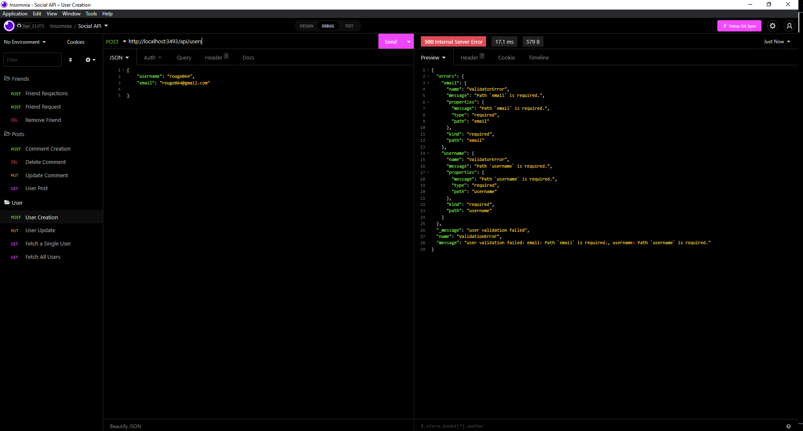

# Social-Network-API

## Description
To better understand web applications that users utilize to communicate their current status, pictures, thoughts, ect., such as Twitter, Facebook, and many more relevant web applications this app was born from that curiosity. Using past technologies learned such as Moment.js, and Express.js this application and furthermore develops my backend skills with Mongo.db and Mongoose otherwise known as No SQL database methods. Insomnia is also utilized to display how the seed data is manifested.

## Table of Contents
* [UserStory](#user-story)
* [Github](#github-repository-url)
* [Installation](#installation)
* [AcceptanceCriteria](#acceptance-criteria)
* [UsageDemo](#usage-demonstration)
* [UsageSnips](#usage-snips)
* [TechnologiesUsed](#technologies-used)

## User Story

```
AS A social media startup
I WANT an API for my social network that uses a NoSQL database
SO THAT my website can handle large amounts of unstructured data

```
## Github Repository URL

https://github.com/Leelai064/Social-Network-API

## Installation
```
1. To utilize this code please cline to your local machine
2. The below technologies below needs to be installed using (npm i <technology>) in terminal
3. Look up documentation for each technology for proper npm i name
* Express.js
* Moment.js
* Mongoose
* Mongo.db
```
## Acceptance Criteria
```md
GIVEN a social network API
WHEN I enter the command to invoke the application
THEN my server is started and the Mongoose models are synced to the MongoDB database
WHEN I open API GET routes in Insomnia for users and thoughts
THEN the data for each of these routes is displayed in a formatted JSON
WHEN I test API POST, PUT, and DELETE routes in Insomnia
THEN I am able to successfully create, update, and delete users and thoughts in my database
WHEN I test API POST and DELETE routes in Insomnia
THEN I am able to successfully create and delete reactions to thoughts and add and remove friends to a user’s friend list
```

## Usage Demonstration


## Usage Snips



## Technologies Used

* Mongo.db
* Express.js
* Node.js
* Mongoose
* Moment.js